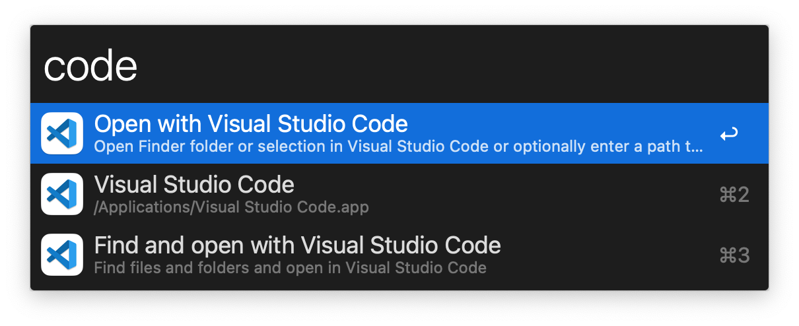

# Visual Studio Code Workflow for Alfred
**Visual Studio Code Workflow for Alfred** is a workflow plugin on Alfred,
which can help you to quickly open your favorite projects,
to improve development efficiency

1. How to quickly open a recently opened project

2. How to quickly open a project that have not been recently opened

3. How to quickly switch project windows when multiple project windows are opened

4. How to quickly reveal the project or the folder in Finder instead

5. How to quickly open the project folder in Terminal

### Requirements
You need:
- Alfred 3.5+
- Visual Studo Code version 1.118.0+

### Installation
Download [Visual Studio Code Workflow for Alfred](./package/alfred-open-pycharm.alfredworkflow?raw=true), double-click the `.alfredworkflow` file to install it in Alfred.

**If 'code' is not recognized as an internal or external command?**

On macOS, you need to manually run the **`Shell Command: Install 'code' command in PATH`** command (available through the **Command Palette** `⇧⌘P`). Consult the [macOS](https://code.visualstudio.com/docs/setup/mac) specific setup topic for details.

### Usage
**Keywords:**

- `code`: Search for recently opened projects
- `codef`: Search for folders, including recently opened and other
projects

**Default**: Open the project in a new window

**Action Modifiers:**

1. `⌘ Command`: Open the project in current VSCode window
2. `⌥ Option`: Reveal project folder in Finder
3. `fn / 🌐`: Open the project folder in Terminal

### How to Use

**Open**
1. Use the keyword `code` to trigger the workflow
2. Press `enter` to open the current folder or the selected file

**Search & Open**
1. Use the keyword `codef` to trigger the workflow
2. Press `enter` or begin to type your file or folder search term
3. Select the file or folder you want to open and press `enter`

## History
See [Releases](https://github.com/jeremy-jin/vscode-alfred-workflow/releases) for detailed changelog.

## License
[MIT License](https://github.com/jeremy-jin/vscode-alfred-workflow/blob/master/LICENSE) © Jeremy